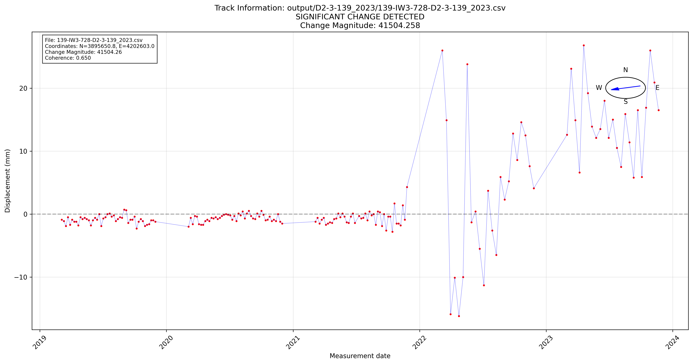

# Visualization

After processing your InSAR data, you have two powerful visualization options: an interactive GIS map viewer and detailed time-series plots. This guide covers both tools and their capabilities.

## Interactive GIS Map Viewer

The `gis_map_viewer.py` script provides a web-based interface for exploring your change detection results.

### Prerequisites

Ensure these files are present in your project directory:

- `change_detection_results.csv` (required)
- `binary_detection.tif` (optional - GeoTIFF overlay)
- `Basisdata_..._FGDB/` folders (optional - historical data)

### Launching the Viewer

```bash
python gis_map_viewer.py
```

This starts a local web server and opens the map in your default browser.

### Map Features

#### Interactive Elements
- **Click Points**: Click any detected change point for detailed information
- **Layer Toggle**: Show/hide different data layers
- **Zoom Controls**: Navigate to areas of interest
- **Legend**: Understand color coding and symbols

#### Information Panels
Each point displays:
- Change magnitude and direction
- Detection confidence
- Temporal information
- Coherence statistics
- Original data source

#### Layer Options
- **Change Points**: Primary detection results
- **GeoTIFF Overlay**: Binary detection visualization
- **Historical Data**: Background reference layers
- **Base Maps**: Satellite imagery and street maps

### Navigation Tips

**Finding Significant Changes**:
- Use layer filters to show only high-confidence detections
- Look for clustering patterns in urban areas
- Check coastal and industrial regions

**Exploring Details**:
- Click points for popup information
- Use zoom to examine spatial patterns
- Compare different time periods if available

## Example Visualization

Here's an example of the detailed time-series analysis you can generate:



*Figure: Time-series analysis showing significant ground motion change detected at point 20201 on Track 139. The plot displays displacement over time with clear indication of the change point detection.*

This visualization demonstrates:
- **Temporal progression** of ground displacement measurements
- **Change point detection** algorithm results  
- **Statistical confidence** intervals and thresholds
- **Before/after analysis** of the detected change

## Time-Series Plots

The `insar-visualizer.py` script generates detailed static plots for specific points.

### Basic Usage

```bash
python insar-visualizer.py --results change_detection_results.csv --num-points 5 --selection mixed
```

### Parameters

#### `--results`
Path to the change detection results file.

```bash
--results /path/to/change_detection_results.csv
```

#### `--num-points`
Number of points to visualize for each category.

```bash
--num-points 10
```

#### `--selection`
Which points to visualize based on change magnitude:

- `highest`: Largest change magnitude
- `lowest`: Smallest change magnitude  
- `middle`: Medium change magnitude
- `mixed`: Combination of all categories
- `all`: All significant points

```bash
--selection highest
```

#### `--output-dir`
Directory for saved plots (default: `visualizations/`).

```bash
--output-dir /path/to/plots
```

### Plot Types Generated

#### Individual Point Plots
Each plot shows:
- **Time series**: InSAR measurements over time
- **Change point**: Detected change moment
- **Trend lines**: Before and after velocities
- **Confidence intervals**: Data uncertainty
- **Coherence overlay**: Data quality indicators

#### Summary Statistics
- **Change distribution**: Histogram of detected changes
- **Spatial patterns**: Geographic distribution
- **Temporal patterns**: When changes occurred
- **Quality metrics**: Coherence and confidence statistics

### Examples

#### High-Impact Changes
```bash
python insar-visualizer.py \
    --results change_detection_results.csv \
    --num-points 3 \
    --selection highest \
    --output-dir high_impact_plots
```

#### Comprehensive Overview
```bash
python insar-visualizer.py \
    --results change_detection_results.csv \
    --num-points 20 \
    --selection all \
    --output-dir comprehensive_analysis
```

#### Quality Assessment
```bash
python insar-visualizer.py \
    --results change_detection_results.csv \
    --num-points 5 \
    --selection mixed \
    --output-dir quality_check
```

## Interpreting Visualizations

### Map Viewer Insights

**Spatial Patterns**:
- Clustered points may indicate localized processes
- Linear patterns might suggest infrastructure effects
- Isolated points could be individual events

**Magnitude Distribution**:
- Large changes (red points) need immediate attention
- Medium changes (yellow) require investigation
- Small changes (green) may be monitoring priorities

### Time-Series Analysis

**Change Detection Quality**:
- **Sharp transitions**: Clear change events
- **Gradual transitions**: Slow-onset processes
- **Noisy data**: Lower confidence detections
- **Multiple changes**: Complex temporal behavior

**Velocity Analysis**:
- **Acceleration**: Increasing subsidence/uplift rates
- **Deceleration**: Slowing ground motion
- **Reversal**: Change from subsidence to uplift (or vice versa)

## Advanced Visualization

### Custom Analysis

For specialized analysis, you can:

1. **Filter Results**: Select specific confidence or magnitude ranges
2. **Temporal Subsets**: Focus on particular time periods
3. **Spatial Regions**: Analyze specific geographic areas
4. **Quality Thresholds**: Use only high-coherence data

### Integration with GIS

Export results for use in professional GIS software:

```python
import pandas as pd
import geopandas as gpd

# Load results
df = pd.read_csv('change_detection_results.csv')

# Convert to GeoDataFrame
gdf = gpd.GeoDataFrame(
    df, 
    geometry=gpd.points_from_xy(df.easting, df.northing),
    crs='EPSG:3035'  # Using EPSG:3035 for accurate European analysis
)

# Export to shapefile
gdf.to_file('change_points.shp')
```

## Troubleshooting

### Map Viewer Issues

**Browser won't open**:
- Manually navigate to `http://localhost:5000`
- Check firewall settings
- Try a different browser

**Missing data layers**:
- Verify required files are in the correct directory
- Check file permissions
- Confirm file formats are correct

**Slow performance**:
- Use fewer data points with filtering
- Close other browser tabs
- Restart the viewer

### Plot Generation Issues

**No plots generated**:
- Verify results file exists and has data
- Check output directory permissions
- Ensure sufficient disk space

**Poor plot quality**:
- Increase figure resolution in code
- Use different output formats (PNG, PDF)
- Adjust plot styling parameters

**Memory errors**:
- Process fewer points at once
- Use `--selection` to limit data
- Close other applications

## Best Practices

### Workflow Integration

1. **Start with Map Viewer**: Get overview of spatial patterns
2. **Identify Key Points**: Focus on high-magnitude changes
3. **Generate Time Series**: Analyze temporal behavior
4. **Document findings**: Save plots and screenshots
5. **Validate Results**: Cross-check with known events

### Quality Control

- Always examine high-confidence detections first
- Compare multiple visualization methods
- Look for consistency in spatial and temporal patterns
- Validate against external information when available

## Next Steps

- Explore [Advanced Features](../advanced/gpu-processing.md) for large-scale analysis
- Review the [API Reference](../advanced/api-reference.md) for detailed command options
- Check out [Contributing](../contributing.md) to help improve the toolkit