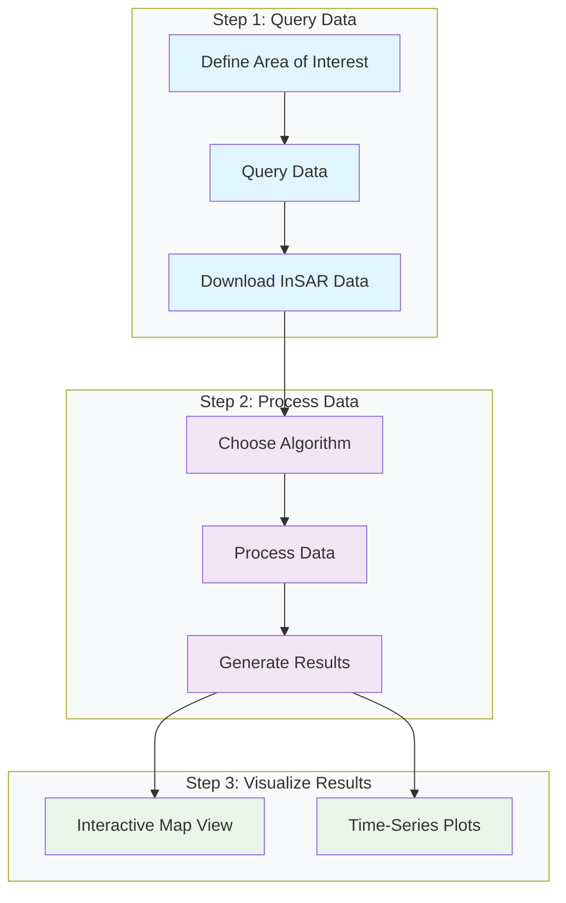
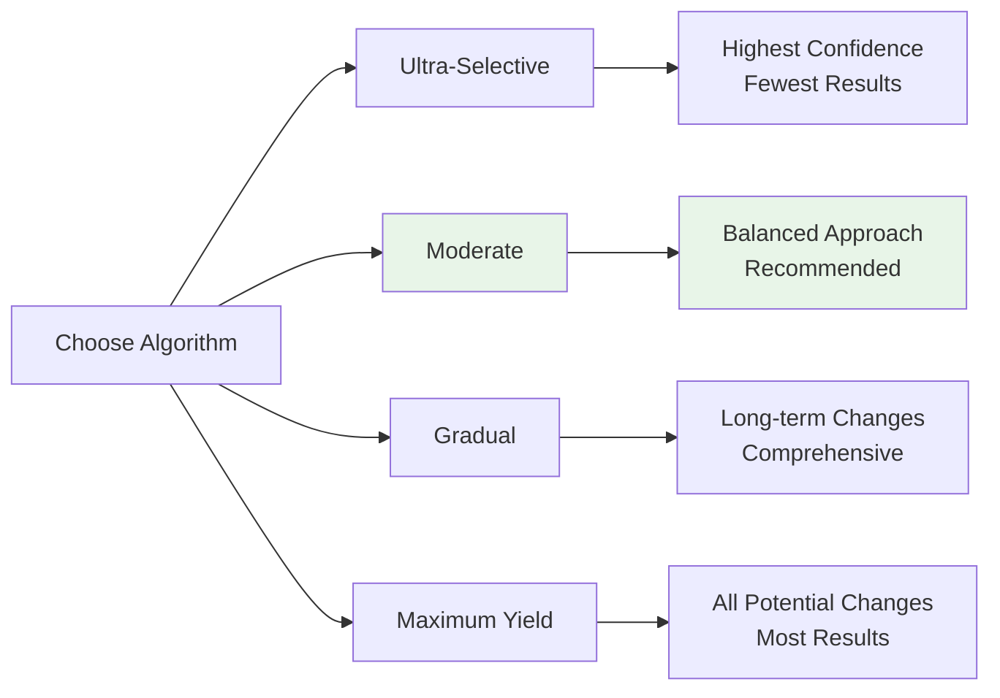
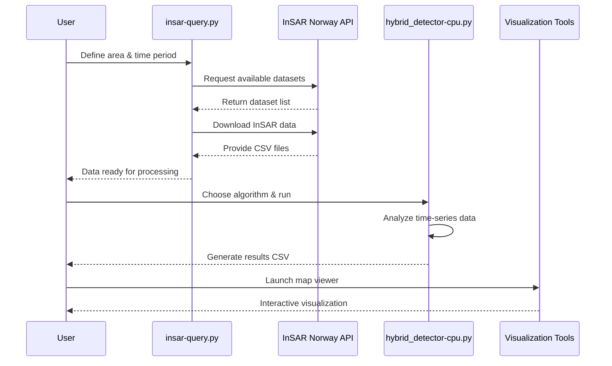

# Workflow Overview

The InSAR Norway Change Detection toolkit follows a streamlined three-step process designed for both technical and non-technical users.

## Process Flow



## Detailed Workflow

### Step 1: Query Data
**Script**: `insar-query.py`

1. **Define your area**: Specify coordinates using bounding box
2. **Choose time period**: Select from available datasets (2018-2024)
3. **Download data**: Automatically retrieve Sentinel-1 InSAR data

```bash
python insar-query.py --path ./data --bbox=7.986,58.149,7.991,58.146
```

### Step 2: Process Data
**Script**: `hybrid_detector-cpu.py`

1. **Select algorithm**: Choose detection sensitivity level
2. **Configure parameters**: Set thresholds and processing options  
3. **Run analysis**: Process time-series data to detect changes

```bash
python hybrid_detector-cpu.py --path ./data --moderate
```

### Step 3: Visualize Results
**Scripts**: `gis_map_viewer.py` and `insar-visualizer-cpu.py`

1. **Interactive map**: Web-based GIS viewer with point details
2. **Time-series plots**: Detailed analysis of detected changes
3. **Export options**: Save results and visualizations

```bash
python gis_map_viewer.py
```

## Algorithm Options



## Data Flow



## Key Benefits

| Step | Benefit | Output |
|------|---------|--------|
| **Query** | **Automated data access** | Raw InSAR measurements |
| **Process** | **Intelligent change detection** | Filtered significant changes |
| **Visualize** | **Interactive exploration** | Maps, plots, and insights |

## Example Result

Here's what you can achieve with the InSAR Norway Change Detection toolkit:


*Real detection result showing ground motion change analysis with temporal progression and statistical confidence.*

## Getting Started

Ready to begin? Follow our [Quick Start Guide](getting-started/quick-start.md) to run your first analysis in minutes.